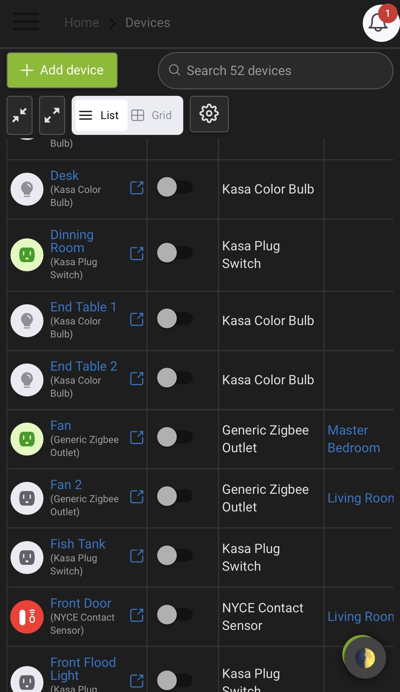

# I am archiving this project because I no longer have a Hubitat to test with. Mine died and I am now just running everything through the alexa hub.


—


# Hubitat Dark Theme

A custom dark mode **JavaScript-injected theme** for Hubitat’s admin interface. This method overrides the default light UI without modifying Hubitat itself. Ideal for use with **reverse proxies** like Nginx Proxy Manager (NPM), Caddy, or Traefik — or manually via browser extensions.

> ✅ No need to modify Hubitat firmware or dashboards  
> ✅ Automatically injects and applies a full dark mode stylesheet

---

## Features

- Seamless dark mode for all core pages
- Improved contrast, readability, and touch support
- Fully mobile-friendly (tested on iOS Safari + Android)
- Themed scrollbars, buttons, inputs, tables, tabs, dropdowns, modals, etc.
- Works even after reboots or firmware updates (when used with a proxy)

---

## Installation Options

### 🔁 Option 1: **Reverse Proxy JavaScript Injection (Recommended)**

This is the most powerful and persistent way to apply the dark theme.

#### ✅ Requirements
- A reverse proxy like **Nginx Proxy Manager (NPM)**, **Caddy**, or **Traefik**
- A public `.js` file that injects the dark theme CSS

#### ✅ Example for **Nginx Proxy Manager**

1. Host your JavaScript injector file somewhere public, e.g.:

```
https://yourdomain.com/hubitat/theme-inject.js
```

2. Add this to your **Custom Nginx Configuration** in NPM:

```nginx
sub_filter '</body>' '<script src="https://yourdomain.com/hubitat/theme-inject.js"></script></body>';
sub_filter_once off;
sub_filter_types text/html;
proxy_set_header Accept-Encoding "";
```

> This injects the JavaScript file at the bottom of every Hubitat page.

3. The JS file dynamically adds the dark theme CSS to `<head>` when the page loads.

---

### 🧩 Option 2: **Browser Extension Injection**

For testing or personal use without a reverse proxy.

Use extensions like:

- **Stylus** (inject JS via `@document`)
- **Tampermonkey / Violentmonkey**
- **User JavaScript and CSS**

Paste in this injection code or link to the hosted JS file.

---

## Hosting the Script

You can host the injector JS file (`theme-inject.js`) on:

- **GitHub Pages**
- **Your own web server**
- **Cloudflare Pages, R2, jsDelivr**, etc.

Example GitHub Pages URL:

```
https://yourgithubusername.github.io/hubitat-dark/theme-inject.js
```

---

## What Should Be In `theme-inject.js`

Example content for the injector file:

```js
// hubitat/theme-inject.js
(function () {
  const cssUrl = 'https://yourdomain.com/hubitat/hubitat-dark.css';
  const link = document.createElement('link');
  link.rel = 'stylesheet';
  link.href = cssUrl;
  document.head.appendChild(link);
})();
```

> Be sure to replace the CSS URL with your actual hosted theme path.

---

## Screenshots

📸 *These screenshots show the theme applied via JS injection through a reverse proxy.*

  


---

## Tips & Compatibility

- ✅ Works across all Hubitat pages, including devices, apps, logs, etc.
- ✅ Works on mobile (iOS/Android)
- 🌓 Compatible with `prefers-color-scheme: dark` if extended later
- ⚠️ `sub_filter` must be enabled in NPM or your proxy config

---

## 📜 License

**MIT** – Free to use, share, or modify.  
Not affiliated with Hubitat Elevation.

---

## 🛠 Made By

[ChilSoft.com](https://chilsoft.com) — fueled by caffeine and irrational CSS decisions.

---

## ⚠️ Disclaimer

This site and theme are provided “as-is” for educational and informational purposes only.  
Use at your own risk. We are **not responsible** for device issues, bricked hubs, lost Z-Wave networks, etc.

© 2025 **ChilSoft**. All rights reserved.
